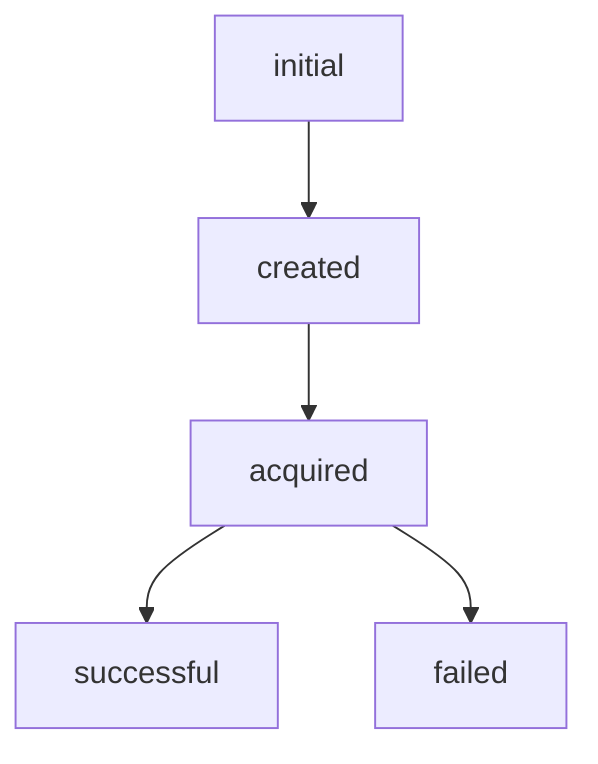

# Rozklad

Rozklad(means schedule in Ukrainian) is a Postgresql based task-queue with delayed execution. Core capabilities:
- schedule task to be executed in the future
- executor that is reading from DB and executing all scheduled tasks (supports multi-node deployment, concurrency is handled by Postgresql)

## Install


```scala
resolvers += "jitpack" at "https://jitpack.io"
libraryDependencies += "com.github.yarhrn" % "rozklad" % "v0.9"	
```

## Usage
### Scheduling
To schedule a task instance of `TaskScheduler[F[_]]` is required. 
To obtain instance of `TaskScheduler[F[_]]` you can provide `doobie.Transactor[F[_]]` to the `new DoobieTaskScheduler[F[_]](tx)`.

Then you can schedule a task by calling `TaskScheduler.schedule`.
`TaskScheduler.schedule` accepts:
- `id` - task identifier, e.g. rozkald.api.Id.random
- `triggerAt`: Instant - point in time after which task should be executed
- `scheduledAt`: Instant - point in time when task is scheduled, e.g. Instant.now
- `payload`: JsValue - some task specific data
### Executing
There are two ways how scheduled tasks can be executed.

Low-level approach gives you full control on acquiring and committing task result. `ScheduledTaskService[F[_]]` (`DoobieScheduledTaskService
`) allows you to:
- `acquireBatch` - atomically and concurrently-safe acquire some number of tasks
- `done` - mark task as successful
- `failed` - mark task as failed

To obtain instance of `ScheduledTaskService[F[_]]` you can provide `doobie.Transactor[F[_]]` to the `DoobieScheduledTaskService[F[_]]`.


ScheduledTask.status([enum](https://github.com/yarhrn/rozklad/blob/main/src/main/scala/api/ScheduledTask.scala#L29)) lifecycle diagram


High-level approach is done via `rozklad.api.ExecutorService.start` that accepts 
`rozklad.api.ScheduledTaskExecutor` - client provided way of how `ScheduledTask` should be executed.
It is implemented as never ending fiber that constantly trying to acquire and execute tasks.
Also, there is method `rozklad.api.ExecutorService.stop` for graceful shutdown.

### DB Scheme
This library is tested with Postgresql and rely on Postgresql features like `select for update` and `skip locked`.
Library requires proper Postgresql scheme setup:
```sql

create table scheduled_tasks
(
    id char(36) primary key not null ,
    scheduled_at timestamp with time zone not null ,
    trigger_at timestamp with time zone not null ,
    status smallint not null ,
    updated_at timestamp with time zone not null ,
    failed_reason smallint ,
    payload jsonb not null
);

create table scheduled_tasks_change_log(
    id char(36) primary key not null ,
    task_id char(36) not null ,
    status smallint not null ,
    created_at timestamp with time zone not null ,
    failed_reason smallint ,
    payload jsonb not null
);

create unique index scheduled_tasks_trigger_at_index
    on scheduled_tasks(trigger_at);
```