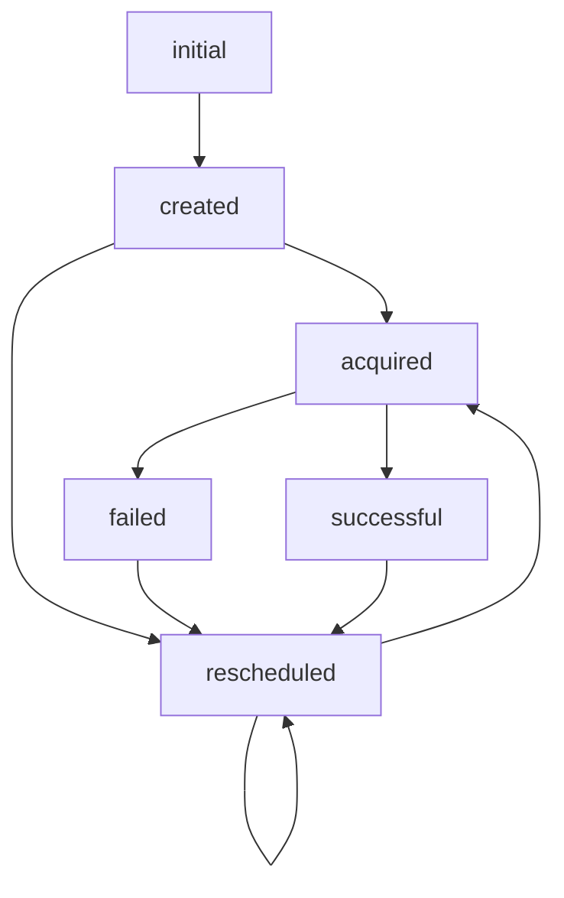

# Rozklad

Rozklad (means "schedule" in Ukrainian) is a persistent PostgreSQL-based task queue with delayed execution.

**Core capabilities:**
- Schedule tasks to be executed in the future
- Runner that reads from the DB and executes all scheduled tasks (supports multi-node deployment, concurrency is handled by PostgreSQL)

## Install


```scala
resolvers += "jitpack" at "https://jitpack.io"
libraryDependencies += "com.github.yarhrn" % "rozklad" % "{take version from badge above}"
```

## Usage

### Scheduling

To schedule a task, an instance of `TaskScheduler[F[_]]` is required.
To obtain one, provide a `doobie.Transactor[F[_]]` to `new DoobieTaskScheduler[F[_]](tx)`.

Then schedule a task by calling `TaskScheduler.schedule`, which accepts:

| Parameter     | Type      | Description                                              |
|---------------|-----------|----------------------------------------------------------|
| `id`          | `Id`      | Task identifier, e.g. `rozklad.api.Id.random`           |
| `triggerAt`   | `Instant` | Point in time after which the task should be executed    |
| `scheduledAt` | `Instant` | Point in time when the task is scheduled, e.g. `Instant.now` |
| `payload`     | `JsValue` | Task-specific data                                       |

### Rescheduling

Starting from 1.0.0, tasks can be rescheduled via the same `TaskScheduler.schedule` method.
Rescheduling occurs when a task with the same `id` already exists and its status is one of `Created`, `Failed`, `Successful`, or `Rescheduled`.

Use `ScheduledTaskService.logs` to introspect the history of a task.
During rescheduling it is possible to update the task's `triggerAt` time and `payload`.

### Executing

There are two ways to execute scheduled tasks.

#### Low-level: `ScheduledTaskService`

Gives you full control over acquiring and committing task results.
`ScheduledTaskService[F[_]]` (implemented by `DoobieScheduledTaskService`) provides:

- `acquireBatch` — atomically and concurrently-safe acquire a batch of tasks
- `done` — mark a task as successful
- `failed` — mark a task as failed

To obtain an instance, provide a `doobie.Transactor[F[_]]` to `DoobieScheduledTaskService[F[_]]`.

**`ScheduledTask.status` lifecycle:**


```mermaid
flowchart TD
    initial --> created
    created --> acquired
    acquired --> successful
    acquired --> failed
    created --> rescheduled
    failed --> rescheduled
    successful --> rescheduled
    rescheduled --> rescheduled
    rescheduled --> acquired
```

#### High-level: `ScheduledTaskRunner`

`ScheduledTaskRunner.start` accepts a `ScheduledTaskExecutor` — a client-provided handler for executing a `ScheduledTask`.
It runs as a never-ending fiber that constantly acquires and executes tasks.
Use `ScheduledTaskRunner.stop` for graceful shutdown.

## DB Schema

This library is tested with PostgreSQL and relies on PostgreSQL features like `SELECT FOR UPDATE` and `SKIP LOCKED`.

The following schema is required:

```sql
CREATE TABLE scheduled_tasks (
    id           CHAR(36) PRIMARY KEY NOT NULL,
    scheduled_at TIMESTAMP WITH TIME ZONE NOT NULL,
    trigger_at   TIMESTAMP WITH TIME ZONE NOT NULL,
    status       SMALLINT NOT NULL,
    updated_at   TIMESTAMP WITH TIME ZONE NOT NULL,
    failed_reason SMALLINT,
    payload      JSONB NOT NULL
);

CREATE TABLE scheduled_tasks_change_log (
    id           CHAR(36) PRIMARY KEY NOT NULL,
    task_id      CHAR(36) NOT NULL,
    status       SMALLINT NOT NULL,
    created_at   TIMESTAMP WITH TIME ZONE NOT NULL,
    failed_reason SMALLINT,
    payload      JSONB NOT NULL,
    trigger_at   TIMESTAMP WITH TIME ZONE NOT NULL
);

CREATE INDEX scheduled_tasks_status_trigger_at_index
    ON scheduled_tasks (status, trigger_at);
```

## Migrations

### 1.0.2 → 1.0.3

```sql
DROP INDEX IF EXISTS scheduled_tasks_change_log;
CREATE INDEX scheduled_tasks_status_trigger_at_index
    ON scheduled_tasks (status, trigger_at);
```

### 0.14 → 1.0.0

```sql
ALTER TABLE scheduled_tasks_change_log
    ADD COLUMN trigger_at TIMESTAMP WITH TIME ZONE DEFAULT NULL;
```
